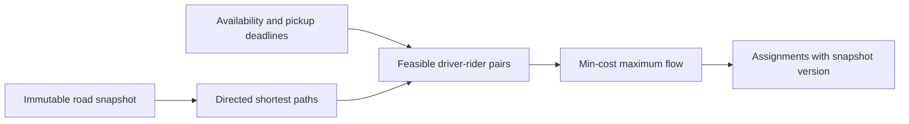

# fleet-match

[](https://github.com/yafi-s/fleet-match/actions/workflows/ci.yml)

**Road-network-aware batch dispatch with a provable optimization objective, in Go.**

Fleet-match computes pickup feasibility on a directed road graph, respects driver
availability and rider deadlines, then finds a maximum-cardinality assignment with
minimum total pickup wait. A greedy nearest-driver baseline makes the cost of local
decisions visible. Immutable road snapshots keep closure updates separate from
in-flight routing queries.

Across the three recorded synthetic 150-rider batches, batch optimization served
**449 of 450 requests**, versus **411 of 450** for the greedy baseline, with extra
solver time. An exhaustive assignment oracle validates 400 randomized small
problems; a separate Floyd–Warshall oracle validates routing.

Relevant to marketplace optimization and geospatial infrastructure at companies
such as Uber. Built with AI assistance; no affiliation, proprietary data, or
production marketplace performance is claimed.

## Run

Go 1.23+, no external modules.

```sh
go test -race ./...
go vet ./...
go run ./cmd/fleet-match < examples/batch.json
go run ./cmd/experiment
```

The JSON CLI accepts a directed graph, snapshot version, simulation time, drivers,
and ride requests. All times and edge costs use integer milliseconds. Output
includes assignments, pickup/finish times, unassigned request IDs, graph version,
and solver work counts. Unknown JSON fields, invalid nodes, negative edge weights,
duplicate entity IDs, oversized input, and malformed batches are rejected.

## Why batching changes the answer

In the included five-node example, driver `d1` can serve either request, but `d2`
cannot reach `r2` before its deadline. Greedy gives nearby `r1` to `d1` and strands
`r2`. Batch matching assigns `d2 → r1` and `d1 → r2`, serving both.



| Concern | Mechanism |
| --- | --- |
| Roads rather than straight-line distance | Dijkstra over directed, nonnegative travel-time edges |
| Assignment quality | Maximum cardinality first, minimum aggregate pickup wait second |
| Efficient residual search | Successive augmenting paths with reduced-cost potentials |
| Road changes | Copy-on-update closure snapshots with increasing versions |
| Deterministic ties | Sorted entity IDs and stable heap ordering |
| Bounded work | Input limits, bounded routing-vector retention, context cancellation |

[Design and complexity](docs/DESIGN.md) · [Measured tradeoffs](docs/BENCHMARKS.md)
· [Tests](dispatch/match_test.go) · [Review guide](docs/REVIEW.md)

## Scope

One driver receives at most one request in a batch. This is a snapshot optimizer,
not a live dispatch service: applying assignments atomically against changing
driver state requires an external version check/transaction. There is no pooled
ride insertion, demand prediction, pricing, demographic data, learned ETA model,
traffic-dependent edge timing, or service-area fairness policy. A driver may be
reserved until its future availability time if the pickup deadline permits it.

Maximizing served riders can increase total wait compared with serving fewer
riders. Minimum total wait also does not minimize the worst individual's wait.
Those are deliberate, visible objective choices.

Uber's public [marketplace matching explanation](https://www.uber.com/us/en/marketplace/matching/)
describes the motivation for batching nearby riders and drivers. Fleet-match is
an independent, simplified implementation with its own objective and tests.

MIT licensed. Companion project: [motion-guard](https://github.com/yafi-s/motion-guard).
